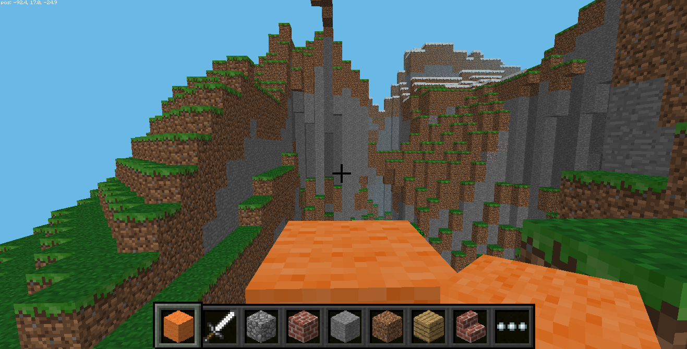
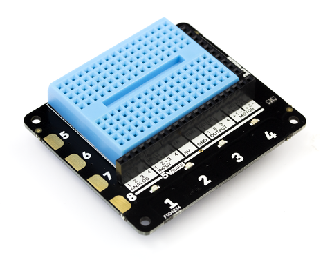

# Getting Started with Minecraft Pi

Minecraft is a popular sandbox open-world building game. A free version of Minecraft is available for the Raspberry Pi; it also comes with a programming interface. This means you can write commands and scripts in Python code to build things in the game automatically. It's a great way to learn Python!


## Building castles with the Python programming interface and Minecraft


Now is time to start building something! We could build a house, but that's a bit boring. What if we build an entire castle every time you place a wool block?


To run Minecraft Pi, open it from the desktop menu or type `minecraft-pi` in the terminal.


When Minecraft Pi has loaded, click on **Start Game**, followed by **Create new**. You'll notice that the containing window is offset slightly. This means to drag the window around you have to grab the title bar behind the Minecraft window.


Bring your focus away from the game by pressing the `Tab` key, which will free your mouse. Open Python 3 opening up a new window (`File > New window`) and save it as Castle-builder.py (`File > Save`) 

Then type the following in the python window:
```python
from mcpi.minecraft import Minecraft

mc = Minecraft.create()
```
This imports the minecraft library and creates a connection to the minecraft game so we can change it.

Because we want to build a castle EVERY time we place a wool block, we need to use a function. Functions allow you to seperate up your code into smaller chunks and make it reusable. Most functions look like a bit like this:

>def functionName(variable1,variable2):
    doSomethingWith(Variable2)

We can "pass" the function a variable each time we use it. To build the castle we will give our functions the players position so it can always know where they are.Functions are all about splitting code up, so we will start with creating a function to make some space for our castle
```python
def clear space(x,y,z):
    mc.setBlocks(x+9,y-2,z+5,x-9,y+10,z+30,0)
```

The x,y,z variables are the player's position (`x` and `z` are the walking directions (forward/back and left/right) and `y` is up/down.).the final number in the mc.setblocks is what block we are using,in this case air.Next we need to create another function and  write the code to make the towers closest to us.
```python
def towers(x,y,z,block):
    mc.setBlocks(x+5, y-1, z+10, x+9, y+8, z+14, block)
    mc.setBlocks(x+6, y-1, z+11, x+8, y+8, z+13, 0)

    mc.setBlocks(x-5, y-1, z+10, x-9, y+8, z+14, block)
    mc.setBlocks(x-6, y-1, z+11, x-8, y+8, z+13, 0)
```
The 'block' varible is like the zero from before,but now we can change it to any block (even lava!).Each tower is made by making one large cuboid of stone using mc.setBlocks() (which fills a volume with a given block), and then making a smaller cuboid of air inside using the same. The Last two towers are very similar, instead this time we need to move them further away from the player by increasing their z coordinates.
```python
    mc.setBlocks(x+5, y-1, z+24, x+9, y+8, z+28, block)
    mc.setBlocks(x+6, y-1, z+25, x+8, y+8, z+27, 0)


    mc.setBlocks(x-5, y-1, z+24, x-9, y+8, z+28, block)
    mc.setBlocks(x-6, y-1, z+25, x-8, y+8, z+27, 0)
```
Now we have the towers set up, lets give ourselves some protection,and build some walls.
```python
def walls(x,y,z,block):
  mc.setBlocks(x+4, y-1, z+12, x-4, y+4, z+12, block)

  mc.setBlocks(x+7, y-1, z+15, x+7, y+4, z+23, block)

  mc.setBlocks(x-7, y-1, z+15, x-7, y+4, z+23, block)

  mc.setBlocks(x+4, y-1, z+26, x-4, y+4, z+26, block)

```
Almost there! now we need to add the most important features of the castle: a floor to stand on and a door so we can actually get into the castle.
```python
def door(x,y,z):
    mc.setBlocks(x+1, y, z+12, x-1, y+2, z+12, 0)
def floor(x,y,z,block):
    mc.setBlocks(x-9, y-1, z+10, x+9, y-1, z+28, block)
```
Thats all the setup finished. We now need to write a way for the computer to know when and where to build our castle. We are going to use the player's position using mc.player.getPos() and what block they are standing on with mc.getBlock() which gives the type of block at a given position . We also need to assign which block we are going to use by assigning the block variable to 1, which is stone First we need to use a while loop so the computer is constantly checking where the player is and what block they are standing on.
```python
block=1
while True:
    x, y, z = mc.player.getPos()
    blockBelow=mc.getBlock(x, y-1, z)

```
For this program we are going to check using an IF statement if the user is standing on orange wool (which has an ID of 35) and if they are we call our functions from earlier and change the block we are standing on to something other than orange wool with mc.setBlock() (or it will keep trying to build a castle untill the player moves).
```python
  if blockBelow == 35:
          clearSpace(x,y,z)
          towers(x,y,z,block)
          walls(x,y,z,block)
          floor(x,y,z,block)
          door(x,y,z)
          mc.setBlock(x, y-1, z,block)
```
You're done! Save and run the program and change to minecraft. An an orange wool block and on the floor and then step on it. BOOM! Instant castle.
What if we could link real life with minecraft? What if we could press a button and have the castle built for us? OR press another button and build another castle made out of LAVA? Let's find out!   

## Building castles with the Explorer HAT


The explorer hat comes with four capacitive touch buttons which work the same way a smartphone's screen does. We are going to assign each button a block, so that every time we press the button a castle made of that block will be built. First go to where we put:
```python
 from mcpi import minecraft
 ```  
and add:
```python
import explorerhat as eh
pressed=0
```
This allows us to use the explorer hat's library, and declares a variable for if a button is being pressed. Next go to our while loop, and add before it a new function:

```python
def buttonPress(channel, event):
    block1=1
    block2=3
    block3=5
    block4=20
    global block
    global pressed
    if channel > 4:
        return
    if event =='press':
        pressed=1
        if channel==1:
            block=block1           
        if channel==2:
            block=block2   
        if channel==3:
            block=block3
        if channel==4:
            block=block4
```
This function changes the block type that our castle will be made of, depending on which button has been pressed. The 'channel' variable is the button, and the event is whether it has been pressed or not. The block variables are what block the house will be made from. You can change them to be anything else, but for now we'll leave them as 1, 3, 5 and 20 which will build the castle out of stone, dirt, wood planks or glass.
The last thing we need to do is change the While loop so it is checking for a button press. First find our
```python
  blockBelow=mc.getBlock(x, y-1, z)
```
and change it to.
```python
    eh.touch.pressed(buttonPress)
```
This tells our function from earlier if a button has been pressed, and which one. Next find our IF statement and change it so it reads:
```python
  if pressed== 1:
```
Now our IF statement checks if a button has been pressed,and it has runs our castle building code. the last thing we need to do is set our pressed variable to 0 otherwise the program will continue to build castles forever. Because we don't need to change the block under us any more find
```python
    mc.setBlock(x, y-1, z,stone)
```
and change it to
```python
  pressed=0
```
And we're done! Jump back into minecraft and every time you press one of the explorer HAT's buttons, a castle will appear!
